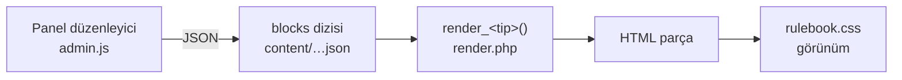

# Bloklar

Sayfa içeriği bir **blok dizisi**. Her blok bir JSON nesnesi; `type` alanı hangi işleyicinin çalışacağını belirler.

```json
"blocks": [
  { "type": "text", "html": "<p>…</p>" },
  { "type": "callout", "tone": "gm", "title": "", "html": "<p>…</p>" }
]
```

## Yedi tip

| Tip | Etiket | Not |
|---|---|---|
| [[Blok - Metin\|text]] | Metin | Zengin metin, en sık kullanılan |
| [[Blok - Not Kutusu\|callout]] | Not kutusu | Üç ton |
| [[Blok - Yetenek Kartı\|skill]] | Yetenek kartı | Ad, nitelik, bedel, etiketler |
| [[Blok - Tablo\|table]] | Tablo | Zar tablosu desteği |
| [[Blok - Yaratık NPC\|statblock]] | Yaratık / NPC | Nitelik ızgarası |
| [[Blok - İki Sütun\|columns]] | İki sütun | 1:1, 2:1, 1:2 |
| [[Blok - Görsel\|figure]] | Görsel | Yükleme + alt yazı |

Kaynak liste: `admin/lib/store.php` → `BLOCK_TYPES`.

## Bir bloğun yolculuğu



Her tip için dört nokta vardır — yeni tip eklerken dördünü de dokunman gerekir, bkz. [[Yeni Blok Ekleme]]:

1. `BLOCK_TYPES` kaydı (`store.php`)
2. `render_<tip>()` fonksiyonu (`render.php`)
3. `editors.<tip>` düzenleyicisi (`admin.js`)
4. CSS sınıfları (`rulebook.css`)

## İlgili
[[İçerik Modeli]] · [[Yönetim Paneli]] · [[Yeni Blok Ekleme]]
