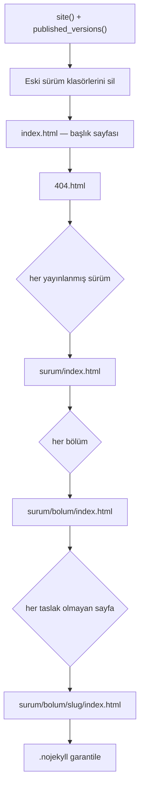

# Build Süreci

`build_all()` fonksiyonu (`admin/lib/build.php`) `content/` + `templates/` → `docs/` dönüşümünü yapar.

## Ne zaman çalışır

1. Panelde her **Kaydet** işleminden sonra otomatik
2. Panelde **docs/ yeniden üret** düğmesiyle elle
3. Terminalden: `php build.php`

## Adımlar



## Ne silinir, ne silinmez

> [!warning] Temizlik kapsamı
> **Silinen:** yalnızca adı sürüm numarası desenine uyan klasörler (`4.0`, `3.0` gibi).
> **Korunan:** `docs/assets/`, `docs/images/`, `docs/.nojekyll`.
> Bu yüzden yüklediğin görseller ve elle yazdığın CSS/JS güvende.

## Filtreler

- `status: draft` sürümler → hiç üretilmez
- `draft: true` sayfalar → hiç üretilmez

Bunlar `published_versions()` ve `pages($v, null, false)` çağrılarıyla uygulanır.

## Çıktı biçimi

Her sayfa kendi klasöründe `index.html` olarak yazılır. Böylece URL'ler uzantısız ve sondaki eğik çizgiyle çalışır: `/4.0/kurallar/savas/`.

## Dönüş değeri

```php
['pages' => 5, 'files' => ['index.html', '404.html', …]]
```

Panel bu sayıyı bildirim satırında gösterir.

## İlgili
[[Şablonlar]] · [[İçerik Modeli]] · [[Komutlar]] · [[Yayınlama]]
