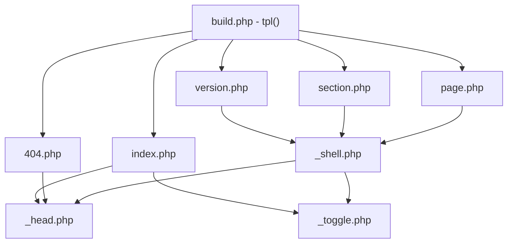

# Şablonlar

`templates/` klasöründeki PHP dosyaları HTML'i üretir. Alt çizgiyle başlayanlar parçadır, diğerleri sayfa şablonu.

| Dosya | Rol | Çıktı |
|---|---|---|
| `index.php` | Başlık sayfası | `docs/index.html` |
| `version.php` | Sürüm ana sayfası | `docs/4.0/index.html` |
| `section.php` | Bölüm dizini | `docs/4.0/kurallar/index.html` |
| `page.php` | İçerik sayfası | `docs/4.0/kurallar/savas/index.html` |
| `404.php` | Bulunamadı | `docs/404.html` |
| `_head.php` | Ortak head | parça |
| `_shell.php` | Okuma kabuğu: üst çubuk, yan menü, alt bilgi | parça |
| `_toggle.php` | Tema anahtarı | parça |

## Çağrı düzeni



## Sözleşme

`tpl($isim, $degiskenler)` şablonu dahil eder ve çıktısını string döndürür (`admin/lib/build.php`). Şablonlar `$site`, `$versions`, `$v`, `$pages` gibi değişkenleri hazır bulur.

Okuma sayfaları şu deseni izler — içeriği tampona al, `$body` değişkenine koy, sonra kabuğu dahil et:

```php
ob_start(); ?>
<article class="prose"> … </article>
<?php $body = ob_get_clean();
$title = 'Sayfa başlığı';
include TPL_DIR . '/_shell.php';
```

## url() yardımcısı

Her site içi bağlantı `url()` fonksiyonundan geçer (`admin/lib/render.php`). Bu, `site.json` içindeki `base` değerini başa ekler; alt klasörde yayınlama tek ayarla çalışır.

```php
<a href="<?= e(url("/$vid/$section/")) ?>">
```

> [!warning] Kaçış
> Kullanıcı verisi daima `e()` ile yazdırılır (`htmlspecialchars`). Zengin metin bunun istisnası — o `clean_html()` süzgecinden geçer, bkz. [[Blok - Metin]].

## İlgili
[[Build Süreci]] · [[Tasarım Sistemi]] · [[Bloklar]]
