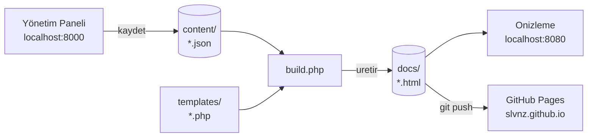

# SLVNZ — Proje Kılavuzu

> [!info] Bir cümlede
> Statik bir kural kitabı sitesi. İçerik `content/` altında JSON; yerel bir PHP paneli bu JSON'u düzenler ve her kayıtta `docs/` klasörüne tüm siteyi statik HTML olarak üretir. GitHub Pages sadece `docs/` klasörünü yayınlar.

## Mimari
- [[Mimari Genel Bakış]] — parçalar ve aralarındaki sözleşme
- [[İçerik Modeli]] — `content/` JSON şeması
- [[Şablonlar]] — `templates/` PHP katmanı
- [[Build Süreci]] — `build.php` ne yapar
- [[Yönetim Paneli]] — `admin/` yapısı ve rotalar
- [[Dosya Haritası]] — hangi dosya ne işe yarar

## Tasarım
- [[Tasarım Sistemi]] — renk ve ölçek token'ları
- [[Tipografi]] — üç yazı tipi ve görevleri
- [[Başlık Sayfası Geometrisi]] — Figma'ya birebir hizalama yöntemi
- [[Tema Sistemi]] — aydınlık / karanlık mantığı
- [[Etkileşimler]] — nav hover, sürüm parlaması, çıkış geçişi
- [[Figma Kaynak Verisi]] — `.fig` dosyasından çıkarılan ham değerler

## İçerik blokları
- [[Bloklar]] — yedi blok tipinin dizini

## İş akışları
- [[Yeni Sayfa Ekleme]]
- [[Yeni Sürüm Çıkarma]]
- [[Yayınlama]]
- [[Yeni Blok Ekleme]] (geliştirici)
- [[Komutlar]]

## Görsel harita
![[Mimari.canvas]]

---

> [!tip] Bu vault nerede
> Proje kökündeki `vault/` klasöründe. Obsidian'da **Open folder as vault** ile bu klasörü aç. Repo'ya commit edilir ama siteye dahil değildir — yalnızca `docs/` yayınlanır.
