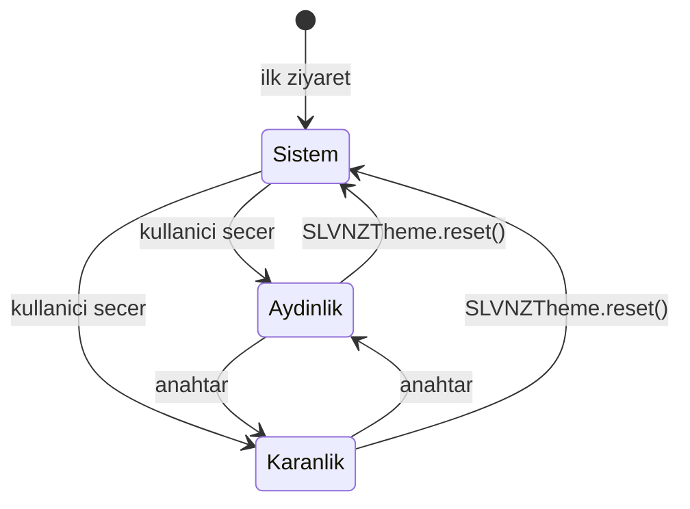

# Tema Sistemi

Üç durumlu. Denetleyici: `assets/js/theme.js`.



| Durum | Nasıl anlaşılır | Kaynak |
|---|---|---|
| Sistemi izle | `<html>` üzerinde `data-theme` yok | `prefers-color-scheme` |
| Aydınlık | `data-theme="light"` | `localStorage` |
| Karanlık | `data-theme="dark"` | `localStorage` |

## Flash önleme

`index.html` (ve `404.html`) `<head>` bloğundaki satır içi script, **ilk boyamadan önce** kaydedilmiş seçimi geri yükler:

```js
(function(){try{var t=localStorage.getItem("slvnz-theme");
if(t==="light"||t==="dark")document.documentElement.setAttribute("data-theme",t);}catch(e){}})();
```

> [!warning] Bu script'i taşıma
> `<head>` içinde, stil dosyasından sonra ve senkron olmalı. `defer` eklersen ya da gövdeye taşırsan sayfa bir an yanlış temada görünür.

## CSS tarafı

Aydınlık `:root` varsayılanı. Karanlık iki seçiciden uygulanır:

```css
@media (prefers-color-scheme: dark) {
  :root:not([data-theme="light"]) { … }   /* seçim yoksa sistemi izle */
}
:root[data-theme="dark"] { … }             /* açık seçim */
```

`data-theme="light"` medya sorgusunu yener — kullanıcı sistem karanlıkken aydınlığı seçebilsin diye.

## Geçiş animasyonu

`theme.js` ilk boyamadan sonra `<html>` üzerine `theme-ready` sınıfı ekler; renk geçişleri (0.35 s) yalnızca o sınıf varken çalışır. Böylece sayfa açılışında yanlış renkten animasyon olmaz.

## Ayrıca senkronize edilenler

- `color-scheme` → yerel form ve kaydırma çubuğu renkleri
- `<meta name="theme-color">` → mobil adres çubuğu
- `--art-invert` → çizim negatife döner
- `storage` olayı → açık sekmeler birbirini takip eder

## Genel API

```js
SLVNZTheme.get()        // 'light' | 'dark'
SLVNZTheme.set('dark')  // seç ve kaydet
SLVNZTheme.reset()      // seçimi sil, sistemi izlemeye dön
```

## Anahtar bileşeni

Her sayfanın altbilgisindeki düğme: 28 × 14 px saç çizgisi ray, 8 px vurgu rengi topuz, iki yanında güneş/ay ikonu. Dokunma hedefi düğme dolgusuyla 44 px'e çıkarılır. `role="switch"` + `aria-checked`.

## İlgili
[[Tasarım Sistemi]] · [[Etkileşimler]]
