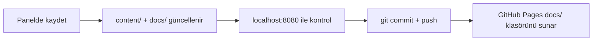

# Yayınlama

## Model



Sunucu tarafı kod yayınlanmaz. `admin/`, `content/`, `templates/` repoda durur ama site yalnızca `docs/` klasöründen servis edilir.

## Bir kerelik kurulum

1. Repo'yu oluştur — kullanıcı sitesi için adı **tam olarak** `slvnz.github.io` olmalı
2. Bağla ve gönder:

```bash
git init -b main && git add -A && git commit -m "İlk sürüm"
```

```bash
git remote add origin https://github.com/slvnz/slvnz.github.io.git && git push -u origin main
```

3. Repo → **Settings → Pages** → Source: **Deploy from a branch** → Branch: `main`, Folder: **`/docs`** → Save

## URL tabanı

| Yayın adresi | `base` değeri |
|---|---|
| `slvnz.github.io` | boş |
| `slvnz.github.io/kural-kitabi` | `/kural-kitabi` |
| Kendi alan adın | boş |

Panelde **Site ayarları → URL tabanı**. Değiştirip kaydedince `docs/` yeni yollarla yeniden üretilir.

> [!warning] İki tuzak
> - Repo **public** olmalı; private repo'da Pages yalnızca ücretli planlarda çalışır.
> - Alt klasörde yayınlarken `base` ayarlanmazsa CSS, görseller ve bağlantılar 404 verir.

## Alan adı bağlama

`docs/CNAME` adında bir dosya oluştur, içine alan adını tek satır yaz (`slvnz.com`). Sonra DNS'te GitHub Pages IP'lerine yönlendir. Bu dosya `docs/` içinde ama üretimde silinmez.

## Kontrol listesi

- [ ] `php build.php` hatasız çalışıyor
- [ ] `localhost:8080` beklendiği gibi
- [ ] Yeni görseller commit'e dahil (`git status`)
- [ ] Taslaklar gerçekten taslak
- [ ] Sürüm durumları doğru (bir tane `current`)

## İlgili
[[Build Süreci]] · [[Komutlar]] · [[Dosya Haritası]]
